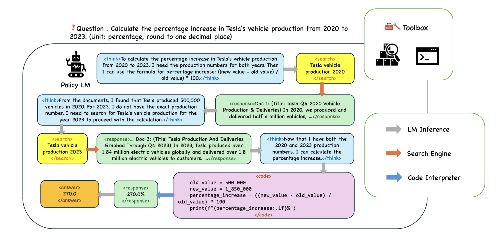

# Tool-Augmented Policy Optimization (TAPO)

This project is forked from [VeRL](https://github.com/volcengine/verl).

TAPO (Tool-Augmented Policy Optimization) is an innovative RL framework evolved from DAPO, designed to seamlessly integrate reasoning capabilities with tool utilization in language models.



## Tool Configuration

### Search Engine Integration

We implement search functionality through Google Serper API. Configuration can be found in:
`recipe/tapo/src/llm_agent/serper_topkcommon.py`

```python
DEFAULT_SERPER_API_KEY = 'your_serper_api_key'  # Replace with your actual API key
SERPER_API_URL = "https://google.serper.dev/search"  # Serper API endpoint
```

### Code Interpreter Setup

For code execution, we recommend deploying a dedicated HTTP server for secure and efficient remote code interpretation. Detailed instructions are available in the `code-server/` directory.

## Environment Setup

We recommend using `uv` for dependency management:

```shell
# Create virtual environment
uv venv --python=3.10

# Install dependencies
uv pip install -e . && \
uv pip install flash_attn && \
uv pip install vllm
```

## Training Process

### Dataset Preparation

> Utilizes `TAPO-easy-60K` and `TAPO-hard-18K` datasets

1. Place TAPO dataset in `warehouse/`
2. Preprocess data:
   ```shell
   python recipe/tapo/src/data_proc/tapo.py --template base
   ```
3. Processed data will be available in `data/tapo`

### Launching Training

1. Initialize Ray cluster:
   ```shell
   ray start --head
   ```

2. Configure training script (e.g., `recipe/tapo/examples/tapo_single_node.sh`)

3. Execute training:
   ```shell
   bash recipe/tapo/examples/tapo_single_node.sh
   ```